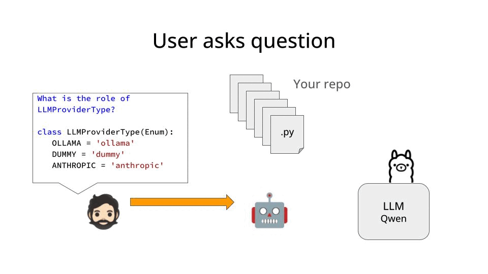

# Let's build a coding assistant with LLMs

## The problem
Coding assistants like Github Copilot or Cursor are great. However, they have one small problem:

As you use them, your source code and any data embedded in it is constantly sent to the LLM provider. Which ultimately means that your data becomes THEIR training data.

This might not seem like a big deal when you work on a side project. However, most companies are 0% interested in sharing their data with others, especially in the Healthcare, Insurance or Banking industry.

So, as a developer working in most companies, you need to find a way to leverage the power of LLMs for fast development, without sharing your data with the LLM provider.

The question is, how to do that?

In this repo you can find a solution to this problem. It's a Python package that allows you to build your own coding assistant, without sharing your data with the LLM provider.

## The solution

The building blocks:

- CLI interface, in this case we use [Typer](https://typer.tiangolo.com/) to build the CLI
- [Ollama](https://ollama.com/) to run LLMs locally. In this case we will use [`qwen2.5-coder`](https://ollama.com/library/qwen2.5-coder), one of the best LLMs for code generation. Feel free to use any other LLM you want from the [Ollama library](https://ollama.com/library).

- A python agent that "sees" all the code you have in your repository and uses it to answer questions and provide code modifications. This is the core of the solution, and one of the areas where you can improve it, and get as fancy as you want.



### Fancy, like what?

The agent we have built here takes a very pragmatic approach to the problem. It's a single LLM that embeds a stringified version of your code in its prompt.

This solution works as long as your codebase is not too large, and can fit inside the LLM context length.

If you need to work with larger codebases, you can use a chunking and searching strategy to using RAG to only include the most relevant code in the prompt.

Moreover, if you want to make the agent more powerful, you can add tools that can help the agent not only suggest code modifications, but also run them.

In this case, it probably makes sense to use a multi-agent system, where each agent is responsible for a different task.

> User intent detection: Does the user need code modifications or just a question?
> Code modification: What exact lines of code to modify and how?
> ...

We will explore this in a future post.

## How to use this assistant?

You first need to install
- [Ollama](https://ollama.com/download) on your machine.
- [uv](https://docs.astral.sh/uv/) to run the CLI in a sandboxed environment.

Once installed, you can run the CLI with the following command:
```bash
$ uv run python cli.py \
    --source-code-path <PATH_TO_YOUR_REPO> \
    --agent-type single-llm \
    --llm-provider ollama \
    --llm-model qwen2.5-coder:7b-instruct
```
where `<PATH_TO_YOUR_REPO>` is the path to the root of your repository.
Feel free to use any other LLM model from the [Ollama library](https://ollama.com/library). I am using qwen2.5-coder:7b-instruct, but you can use any other model you want.

Be aware that the larger (and potentially better) the model you use, the longer it will take to generate a response.

## How does the code work?

The core abstractions are

- `Repo` to load the code from the repository
- `LLM` to interact with the LLM
- `Agent` to interact with the user and provide a way to interact with the LLM

Each of them has a single responsibility, and they are designed to be easily interchangeable.

For example, if you want to generate a 2-LLM agent, for example:
- 1 small LLM to understand the user intent, among
    - "I want to add a new feature"
    - "I want to fix a bug"
    - "I want to improve the performance of the code"
    - "I have a question about the code"
- 1 large LLM to carry out the (more complex) task of code modifications

you can generate a new agent from the base `Agent` class and add it to the `AgentFactory` class.


## Wanna learn to build real world software using LLMs?

I am preparing a new course on Real World ML Engineering.

It will be LIVE, meaning you and me will build from 0 to 1 a real world ML product using

- Python and Rust
- LLMs
- RAG
- Agents

No more clanky Langchain demos.
Only things that work (and companies need) in the real world.

Subscribe to my newsletter to get notified when the course is ready.

[>>> 🔔 Subscribe NOW 🔔 <<<](https://paulabartabajo.substack.com/)

## References
https://simonwillison.net/2024/Sep/2/anatomy-of-a-textual-user-interface/
